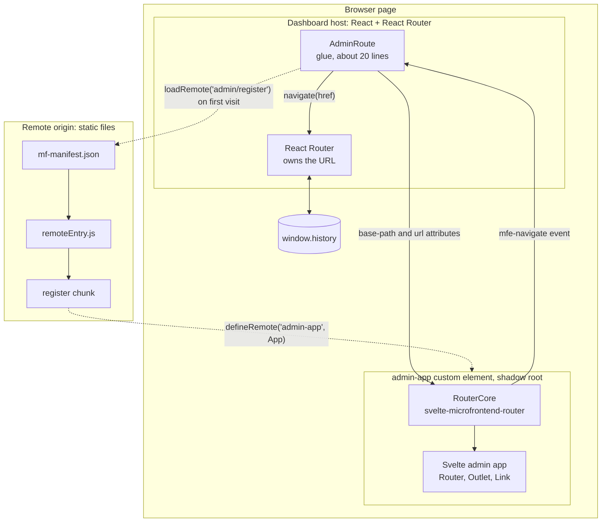
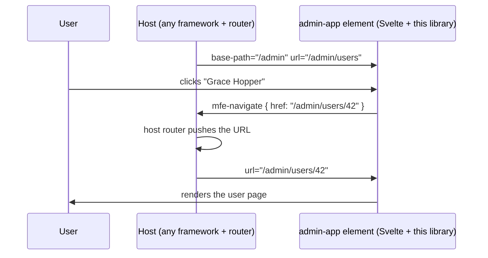

# svelte-microfrontend-router

Path-based routing for Svelte 5 apps, including apps that run as microfrontends inside a host built with any other framework.

A Svelte app mounted under `/admin` in a React (or Vue, Angular, plain JS) host gets real URLs like `/admin/users/42`, with nested routes, params, query strings, back/forward and deep links, while the host's own router stays in sync. No hash routing, no patching of `window.history`.

This repo holds the library and a demo: the same Svelte admin app (remote) running inside a React dashboard and a Vue dashboard (hosts), loaded through Module Federation 2.0. The remote doesn't change between the two.

## The problem

Svelte ships no router, and the options that exist don't work well inside another app:

- **Two routers, one URL.** When the Svelte app changes the URL with `history.pushState`, the host's router doesn't notice. Its active links and its idea of "where am I" go stale, and nothing crashes, so the bug goes unseen.
- **The usual workaround is hash routing** (`/admin#/users/42`): ugly links, and the host can't see where the user is.
- **SvelteKit can't be embedded**, and Module Federation's bridge packages cover React and Vue, not Svelte.

This problem shows up in practice: Module Federation's own tracker has an open question from a team whose remote "stays frozen on the previous state" while the URL changes ([module-federation/core#4284](https://github.com/module-federation/core/discussions/4284)).

## How it works

**The host owns the URL. The remote owns its pages.** The host hands the remote a base path, and the remote renders everything under it.



A navigation, step by step:



The whole contract is plain DOM, so any framework can use it:

| Direction | Mechanism |
| --- | --- |
| Host to remote | `base-path` and `url` attributes on the custom element |
| Remote to host | a cancelable `mfe-navigate` event with `{ href, replace }` |
| Lifecycle | adding the element mounts the app, removing it cleans up |

If no host handles the event, the remote writes history itself and fires `popstate`, so it still works with zero glue. The same app also runs on its own (plain `<Router>`, owning browser history), which is how the remote team develops it.

## Usage

**In the Svelte app (the remote):**

```ts
// routes.ts: paths are relative to wherever the host mounts the app
export const routes = [
  { path: '/', component: Layout, children: [
    { path: '/', component: Overview },
    { path: '/users', component: UserList },
    { path: '/users/:id', component: UserDetail },
    { path: '*', component: NotFound },
  ]},
]
```

```svelte
<!-- App.svelte -->
<script>
  import { Router } from 'svelte-microfrontend-router'
  import { routes } from './routes'
</script>

<Router {routes} />
```

```ts
// register.ts: registers <admin-app> for hosts
import { defineRemote } from 'svelte-microfrontend-router'
import App from './App.svelte'

defineRemote('admin-app', App)
```

Inside components: `<Link to="/users/42">`, `<Outlet />` for nested layouts, and `getRouter()` for `params`, `query`, `navigate()`, `navigateHost()` and `setQuery()`.

**In the host (React 19 + React Router shown; any framework works the same way):**

```tsx
<Route path="admin/*" element={<AdminRoute />} />

function AdminRoute() {
  const location = useLocation()
  const navigate = useNavigate()
  return (
    <admin-app
      base-path="/admin"
      url={location.pathname + location.search + location.hash}
      onmfe-navigate={(event) => {
        event.preventDefault()
        navigate(event.detail.href, { replace: event.detail.replace })
      }}
    />
  )
}
```

**The same in Vue 3 + Vue Router:**

```vue
<!-- route: { path: '/admin/:rest(.*)*', component: AdminRoute } -->
<admin-app
  base-path="/admin"
  :url="route.fullPath"
  @mfe-navigate="(event) => { event.preventDefault(); router.push(event.detail.href) }"
/>
```

The demos' full versions also load the remote and handle loading and failure: [`AdminRoute.tsx`](apps/demo-host-react/src/AdminRoute.tsx) (React) and [`AdminRoute.vue`](apps/demo-host-vue/src/AdminRoute.vue) (Vue).

## Run the demo

Requires [mise](https://mise.jdx.dev) (pins Node and pnpm) or Node 24 with pnpm 12.

```bash
pnpm install
pnpm dev
```

- http://localhost:5173: the **React** dashboard. Open **Admin** and click around: the host's "location" line and its active nav link follow every click inside the Svelte app.
- http://localhost:5175: the **Vue** dashboard, with the same Svelte app inside.
- http://localhost:5174: the Svelte admin app on its own, with the same routes.

Each app is labeled in the page (React host, Vue host, Svelte remote).

Other commands: `pnpm test`, `pnpm typecheck`, `pnpm build`.

## What's in the repo

| Path | What it is |
| --- | --- |
| [`packages/svelte-microfrontend-router`](packages/svelte-microfrontend-router) | The library: route matcher, router core, `Router` / `Outlet` / `Link`, and `defineRemote()` (the custom element that implements the host contract) |
| [`apps/demo-remote`](apps/demo-remote) | Svelte 5 admin app built on the library, exposed through Module Federation (`@module-federation/vite`, with a manifest) |
| [`apps/demo-host-react`](apps/demo-host-react) | React 19 + React Router dashboard that registers and loads the remote at runtime (`@module-federation/runtime`) |
| [`apps/demo-host-vue`](apps/demo-host-vue) | Vue 3 + Vue Router dashboard doing the same, to show the remote works unchanged in a second framework |
| [`docs/design.md`](docs/design.md) | The design: problem, contract, decisions and tradeoffs, prior art |

## Design decisions

- **The library owns the custom element** (`defineRemote`), so the contract (attributes, event flags, fallback, cleanup) lives in one place and remote teams can't get it wrong.
- **Shadow DOM by default** for CSS isolation in both directions: the host's global styles don't reach the remote, and the remote's styles don't leak out.
- **Nothing global is patched.** Each remote element scopes its routing to its own base path.
- **The host loads remotes at runtime**, not from its build config, so a slow or broken remote only affects its own section: the rest of the dashboard renders immediately, and the remote's section shows a retryable error.

More in [`docs/design.md`](docs/design.md).

## Compared to other Svelte routers

[`@svelte-router/core`](https://github.com/WJSoftware/svelte-router-core) is the most complete Svelte 5 router and also targets microfrontends, by intercepting `window.history` page-wide and with multi-hash routing. It keeps the Svelte side in sync with the host, but doesn't tell the host's router about the Svelte app's own navigations. This library takes the opposite position: the host's router stays the authority and hears every navigation, with no global patching. For hash-based microfrontends, single-spa, or a broader feature set, `@svelte-router/core` is the better choice.

## Status

Working and tested:
- 76 unit and component tests: the matcher, the router core, `Link`, the standalone `Router`, and the custom element in both modes (fallback, mode switches, moving and removing it, shadow DOM styles).
- Checked in the browser with both hosts, in dev and production builds: deep links, host router sync, query params, back and forward, both kinds of 404, and the remote failing to load and recovering.

Known limits (case-sensitive paths, exact-match active links, no SSR) are listed in [`docs/design.md`](docs/design.md#internals).

Next: CI, a live demo, and publishing to npm.

## License

MIT
