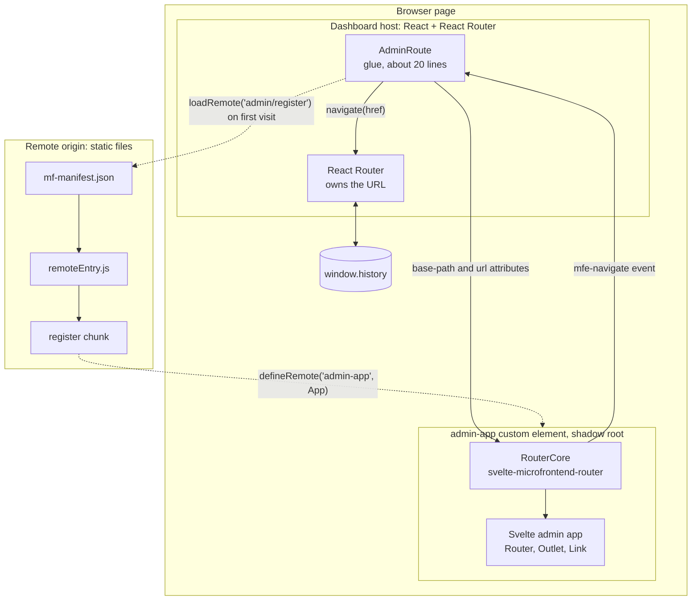

# Design: routing for Svelte 5 remotes inside any host

This document explains why `svelte-microfrontend-router` exists and how it's built: the problem, the requirements, the host contract, and the decisions behind it. For usage, see the [README](../README.md). For a module-by-module tour of the code, see [internals.md](internals.md).

# Part 1: Problem

## The situation

- A **host** app owns the page and the browser URL. It can be any framework (React, Solid, Angular, vanilla) with any router. The library must not care which.
- A **Svelte 5 remote** is exported as a **web component** (custom element). How its JS reaches the page (Module Federation, a script tag, `import()`) is **not** the library's concern.
- The host renders the remote's element inside a route that owns a **base path**, for example everything under `/admin/*`.
- The remote team wants a **real routed app** under that base path: `/admin`, `/admin/users`, `/admin/users/42`, with nested routes, params, links and back/forward.

## Why it's a problem today

1. **Two routers, one URL.** Host and remote routers would both read and write the same browser history. Most host routers only notice changes they made themselves, or `popstate` (back/forward). If the remote calls `history.pushState`, the URL changes but the host router's internal location goes stale: active links and anything else reading the host's location are wrong. It fails quietly because `/admin/*` still matches.
2. **The workaround is hash routing** (`/admin#/users/42`), which avoids the conflict by using a part of the URL the host ignores. The costs:
   - two URL schemes on one page, and ugly shared links;
   - the host can't see the remote's real location;
   - it clashes with any other use of the hash.
3. **Svelte has no router to build on.** Svelte itself ships no router. Routing comes from SvelteKit, which assumes it owns the whole page and can't live inside another app, or from community routers, which use hash URLs or assume they're the only router and write to `window.history` directly. React and Vue have bridge packages that sync their routers with a host. Svelte has neither a suitable router nor a bridge. **So this library is the router itself**, built from the start to live inside a host, not an adapter for an existing one.

## The problem is real

- Module Federation's Bridge handles host-remote routing only for React and Vue, and its router support only covers React Router. Other routers have to opt out and handle routing themselves. There's no Svelte support. ([Bridge overview](https://module-federation.io/practice/bridge/overview))
- Even with the React bridge, teams hit this exact sync bug: a host and a remote with separate routers, where the browser URL updates but the remote "stays frozen on the previous state". The open question is how to propagate the host's location down to the remote's router. ([module-federation/core discussion #4284](https://github.com/module-federation/core/discussions/4284), January 2026, unanswered)

## Ownership model: delegation

The host declares one thing: **"everything under `<basePath>` belongs to this remote."** It doesn't know or register the remote's routes.
- The remote team can change routes without any host change or deploy.
- Neither side needs to understand the other's framework or router.
- Accepted cost: the host can't do per-route guards, breadcrumbs or typed links into remote pages. Not in scope now.

## Constraints

1. **Host-agnostic.** The host-remote contract is plain DOM: attributes on the custom element and DOM events. No host framework or router code in the library.
2. **Svelte 5 remote, no SvelteKit.**
3. **One routed remote per page** (multiple remotes is a later phase).
4. **The browser URL is the single source of truth.** No hash routing, no separate in-memory location that can drift.
5. **Loading is out of scope.** The library works however the element's JS was loaded.

## Requirements (definition of done)

| # | Scenario | Expected |
| --- | --- | --- |
| R1 | Remote defines routes | Routes are relative to its base (`/users/:id`). `/admin` is never hardcoded. |
| R2 | Link or programmatic navigation inside the remote | Real URL becomes `/admin/users/42`, the host router's location stays in sync, and the remote isn't remounted. |
| R3 | Host navigates into the base path (host nav link, deep link on page load) | The remote renders the matching route, with no remount if it's already on the page. |
| R4 | Back / forward within remote routes | The URL and the remote view move together, and the host stays in sync. |
| R5 | Remote navigates out (`/settings`) | Handled by the host router. The remote is removed. |
| R6 | Leaving and re-entering the base path | Removing the element cleans up every listener. Adding it again works and shows the right route. |
| R7 | Unknown path under the base (`/admin/nope`) | The remote shows its own not-found view. |
| R8 | Query string and params | Readable and writable by the remote under the base path. |
| R9 | Standalone use | The same app and routes run with no host: as a plain Svelte app with `<Router>`, and as the remote element on a page with no host glue. |
| R10 | Host swap | Changing the host framework or router needs no remote change, at most a few lines of host glue. |
| R11 | Library quality | Published to npm as ESM with types, `svelte` as a peer dependency, no runtime dependencies, semver with a changelog. |

## Out of scope

- How the remote is loaded (Module Federation, script tag, `import()`)
- Multiple routed remotes on one page
- SSR
- Navigation blocking (e.g. "unsaved changes" prompts)
- State sharing between host and remote beyond the URL
- Host-side knowledge of remote routes (guards, breadcrumbs, titles)

## Prior art

**[`@svelte-router/core`](https://github.com/WJSoftware/svelte-router-core)** (WJSoftware, v1.0.7, active) is the closest existing library: a full-featured Svelte 5 router (path, hash and multi-hash routing, base paths, nested routers, active links, redirects, Electron, SvelteKit and single-spa integrations) that explicitly targets micro-frontends. Its micro-frontend support takes a different approach:

- **Multi-hash routing:** each micro-frontend routes inside its own named part of the URL hash. It's a refined version of the hash workaround this library avoids.
- **"Full mode":** it replaces `window.history.pushState` and `replaceState` for the whole page, so it notices when a host router changes the URL.

Compared against this problem (from reading its source, not just its README):

| Concern | `@svelte-router/core` (full mode) | This library |
| --- | --- | --- |
| Host navigates, Svelte app updates | Yes, it catches the host's `pushState` through the patch. | Yes, the host passes the URL down through the `url` attribute. |
| Svelte app navigates, host router updates | No. It calls `pushState` directly and dispatches no event, so the host router goes stale. | Yes, it asks the host through `mfe-navigate`, and the host's router performs it. |
| Host router's history state | Any `pushState` whose state isn't in its `{ path, hash }` shape is replaced with its previous state, unless the app writes a `beforeNavigate` handler to fix it. React Router and TanStack Router keep their own data there. | Untouched. The host's router owns history. |
| Global side effects | Patches `window.history` page-wide. | None. Scoped to one element. |
| Contract with the host | None. The Svelte side takes control. | Two attributes and one event, usable from any framework. |
| Web component packaging | No. | `defineRemote()`. |
| Router features | Much broader. | Deliberately small. |

**Our position:** both directions stay in sync, the host's router stays the authority, nothing global is patched, and the contract is a plain element. `@svelte-router/core` remains the better choice for hash-based micro-frontends, single-spa setups, or when you need its wider feature set.

# Part 2: Design

## Core idea

**The host owns the history. The remote owns the routes.**

- In a host, the remote never decides the URL on its own. It asks the host to navigate (a DOM event), and the host's router performs the change, so the host router can't go stale (R2, R4).
- The host tells the remote the current URL through an attribute, updated on every host location change. There's one listener (the host router) and one source of truth (the URL).
- The remote works in paths relative to the base path. The library strips the base on the way in and adds it on the way out (R1).
- With no host handling navigation (standalone dev, or a host that wrote no glue), the library falls back to managing `history` itself (R9, R10).

## Architecture



- **Only the host touches `window.history`** while the remote is host-managed. The remote learns the URL from the `url` attribute and asks for changes with `mfe-navigate`.
- **The element is the boundary.** Everything inside it (router core, Svelte app, styles in the shadow root) belongs to the remote team; everything outside belongs to the host.
- **Loading is separate from routing.** The Module Federation runtime fetches the remote's files the first time `/admin` is visited; once `admin-app` is defined, only the contract matters. The library works the same with any other loader.

## The host contract

Everything the host needs to know. It's plain HTML and DOM, so it works in any framework.

```html
<admin-app base-path="/admin" url="/admin/users/42?role=editor"></admin-app>
```

| Direction | Mechanism | Meaning |
| --- | --- | --- |
| Host to remote | `base-path` attribute | The prefix this remote owns. |
| Host to remote | `url` attribute (path + query + hash) | The current location. The host updates it on every location change. |
| Remote to host | `mfe-navigate` event: `CustomEvent`, `bubbles`, `composed`, **`cancelable`**, `detail: { href, replace }` | "Please navigate to `href`." `href` is a full path (base included), or a host path when navigating out. |
| Lifecycle | Adding / removing the element | Adding mounts the Svelte app, removing unmounts it and cleans up (R6). |

**Two modes, chosen automatically:**

| Mode | When | Navigation | Location updates |
| --- | --- | --- | --- |
| **Host-managed** | `url` attribute is set | Dispatch `mfe-navigate`. If the host calls `preventDefault()`, the host router navigates. If not, fall back: `history.pushState`/`replaceState` + a synthetic `popstate` so the host's router can pick it up, and the remote shows the new page itself. | From the `url` attribute only. |
| **Self-managed** | No `url` attribute (standalone) | `history.pushState`/`replaceState` directly. | The element reads `window.location` and listens to `popstate` itself. |

The remote never updates its view optimistically on navigate. It re-renders when the location comes back (a new `url` attribute or `popstate`, or, in the no-host fallback, right after it wrote history itself), so the view always matches the real URL.

**Lifecycle details:**
- Adding or removing `url` after mount switches between the two modes (the app remounts in the new mode).
- Moving the element in the DOM (disconnect and reconnect in the same task, as React and Vue do when reordering) keeps the app mounted.
- An app that was removed can't change the URL any more (a late timer or fetch calling `navigate` is ignored).
- `base-path` can change after mount; routes re-derive.

### Flows (host-managed)

```
Remote <Link to="/users/42"> clicked
  element dispatches mfe-navigate { href: "/admin/users/42" }
  host glue: preventDefault() + hostRouter.navigate(href)
  host re-renders <admin-app url="/admin/users/42">  ──▶  remote renders UserDetail

Back button / host nav link / deep link
  browser ──popstate──▶ host router (the only listener)
  host re-renders <admin-app url="...">  ──▶  remote renders the matching route

Navigate out: navigateHost("/settings")
  mfe-navigate { href: "/settings" }  ──▶  host routes away and removes <admin-app>  ──▶  cleanup
```

**No remount (R2, R3):** the host renders the element in a catch-all route for the base path (`admin/*` in React Router, `/admin/$` in TanStack Router, a prefix check in vanilla). Path changes under the base only update the `url` attribute, so the same element stays on the page.

## API

The same routes and components serve both uses. A plain Svelte app uses `<Router>` directly. A remote adds one call, `defineRemote()`.

**Plain Svelte app (no host)**

```svelte
<!-- App.svelte -->
<script>
  import { Router } from 'svelte-microfrontend-router'
  import { routes } from './routes'
</script>

<Router {routes} />
```

With no remote context, `<Router>` uses the browser's history directly (base path `/`, or a `basePath` prop).

**Remote inside a host**

**Entry: register the element**

```ts
// src/register.ts (exposed to hosts as `./register`)
import { defineRemote } from 'svelte-microfrontend-router'
import App from './App.svelte'

defineRemote('admin-app', App)
```

`defineRemote(tag, Component, options?)` defines a custom element class that:
- mounts `Component` with Svelte's `mount()` on connect and `unmount()`s it on disconnect (deferred a microtask, so moving the element doesn't remount);
- observes `base-path` and `url` and feeds them to the router;
- picks the mode (host-managed or self-managed), switches if `url` is added or removed, and dispatches `mfe-navigate` or uses the fallback;
- provides the router through Svelte context (`createContext`, set in a wrapper function passed to `mount()`, the pattern from Svelte's context docs).

Options: `{ shadow?: boolean }` (default `true`: the app renders inside a shadow root for CSS isolation; see decisions).

**Routes: a table**

```ts
// src/routes.ts: shared navigation lives in a root layout that renders <Outlet />
export const routes = [
  { path: '/', component: Layout, children: [
    { path: '/', component: Overview },
    { path: '/users', component: UsersLayout, children: [
      { path: '/', component: UserList },
      { path: '/:id', component: UserDetail },
    ]},
    { path: '*', component: NotFound },
  ]},
]
```

`<Link>` and `getRouter()` need the router from context, so in a plain app they must be inside `<Router>`: put shared navigation in a root layout route, as above.

**Components and functions**

| API | What it does |
| --- | --- |
| `<Router {routes} />` | Renders the top-level match. |
| `<Outlet />` | Renders the next nested match inside a layout component. |
| `<Link to="/users" replace?>` | Renders a real `<a href="/admin/users">` (so middle-click, copy link, open in new tab work). Intercepts only plain left clicks: no modifier keys, no `target`, no `download`. Clicking the current page replaces the history entry. Absolute URLs (`https:`, `mailto:`, `//host`) are left to the browser; `javascript:` URLs get no `href`. Sets `aria-current="page"` on an exact path match (query ignored). |
| `getRouter()` | Called in a component's script. Returns the router for this app: |
| `router.path`, `router.params`, `router.query`, `router.hash` | Reactive current location relative to the base (`path` is `null` when the URL is outside the base). `query` is a read-only `URLSearchParams`. |
| `router.url`, `router.basePath`, `router.matches` | The full current URL, the base path, and the matched route chain. |
| `router.navigate(to, { replace? })` | Navigate within the app. `to` is relative to the base and can include `?query` and `#hash`. Navigating to the current URL replaces by default. Absolute URLs throw (use `navigateHost` or a plain `<a>`). |
| `router.navigateHost(href, { replace? })` | Navigate outside the app to a host path (R5). |
| `router.setQuery(updates, { replace? })` | Update query params (R8). `null` removes a key. Keeps the path and hash; does nothing while the URL is outside the base. |
| `router.href(to)` | The full URL for a relative path (base included). |

The router comes from Svelte context, not a module-level singleton, so each app (and later, each remote on a page) has its own.

Under both sits a framework-free router core, `createRouter({ url, basePath?, routes?, navigate })`, returning a `RouterCore`. `<Router>` builds one on browser history when used alone (`createBrowserRouter`), and `defineRemote` builds one on the host contract. Also exported: `NAVIGATE_EVENT` (`'mfe-navigate'`) and the types (`RouteDefinition`, `Params`, `RouteMatch`, `NavigateOptions`, `QueryUpdates`, `MfeNavigateDetail`, `DefineRemoteOptions`).

## Internals

- **Matcher:** compile each route path into segments; supports static segments, `:params`, and `*` catch-all. Ranking: static beats param beats catch-all. Nested routes match the parent prefix, then the children. `URLPattern` isn't used because browser support is incomplete.
- **Base path handling:** normalize trailing slashes (`/admin` and `/admin/` both mean the remote's `/`), never let a relative `to` escape the base, and treat a location outside the base as "not mine" (render nothing while the host removes the element).
- **State:** `RouterCore` is a class in a `.svelte.ts` module with `$state` fields (URL, base path, routes) and `$derived` fields (path, query, matches), updated only from a location update. Components read it through context created with Svelte's `createContext` (hence the `svelte ^5.57` peer dependency).
- **Element:** a plain `HTMLElement` subclass we write (public Svelte APIs only: `mount`, `unmount`, `createContext`). No reliance on Svelte's `customElement` compiler option, which keeps `defineRemote` in full control of attributes, events and cleanup. Its attributes have no matching JS properties on purpose: React 19 then always sets `url` and `base-path` as attributes.
- **Cleanup (R6):** the element tracks every listener it adds (only `popstate`, and only in self-managed mode) and removes them on unmount.
- **Scroll:** when the router writes history itself (plain app, self-managed, or the no-host fallback), a push scrolls to the top. In host-managed mode the host router owns scrolling. Focus management is deferred.
- **Known limits (documented, not built):** paths are case-sensitive; route patterns are matched literally (no encoded characters in patterns); `aria-current` is an exact match with no prefix matching; defining the same tag twice returns the existing element without a warning; no SSR.

## Host integration

No host package is required. The contract is documented DOM.

**React 19 + React Router (the demo host):** `apps/demo-host-react/src/AdminRoute.tsx`, trimmed:

```tsx
export function AdminRoute() {
  const location = useLocation()
  const navigate = useNavigate()
  const [status, setStatus] = useState<'loading' | 'ready' | 'failed'>(...)
  // useEffect: loadAdminRemote() then setStatus('ready'), or setStatus('failed') on error

  // React 19 attaches `on<event>` props on custom elements as native listeners,
  // before the element is inserted, so no navigation request can be missed.
  const onNavigate = (event: CustomEvent<MfeNavigateDetail>) => {
    event.preventDefault()
    const { href, replace } = event.detail
    if (href.startsWith('/') && !href.startsWith('//')) navigate(href, { replace })
    else window.location.assign(href) // not a path in this app
  }

  if (status === 'failed') return <Alert>couldn't be loaded <button>Try again</button></Alert>
  return (
    <>
      {status === 'loading' && <p>Loading admin…</p>}
      <admin-app base-path="/admin" url={location.pathname + location.search + location.hash} onmfe-navigate={onNavigate} />
    </>
  )
}
// <Route path="admin/*" element={<AdminRoute />} />
```

**Vue 3 + Vue Router (the second demo host):** `apps/demo-host-vue/src/AdminRoute.vue` does the same with `<admin-app base-path="/admin" :url="route.fullPath" @mfe-navigate="onNavigate" />`, a catch-all route `/admin/:rest(.*)*`, and `isCustomElement` set for `admin-app` in the Vue compiler options. The remote is unchanged.

**When the remote fails to load:** the host still owns `/admin/*`. The URL stays, the host layout and navigation keep working, only the admin section shows the error with **Try again**. A failed load isn't cached, so retrying or coming back to `/admin` tries again.

**Vanilla host (test fixture):** render `<admin-app base-path="/admin" url="...">` when the path starts with `/admin`, update `url` on `popstate`, and don't handle `mfe-navigate`, so the fallback path is exercised.

**Loading the element in the demo:** Module Federation 2.0.
- **Remote** (`@module-federation/vite`): exposes `./register` (`src/register.ts`, which calls `defineRemote('admin-app', App)`) in `remoteEntry.js`, and generates `mf-manifest.json` (recommended in MF 2.0). Nothing is shared (React host, Svelte remote); type generation is off.
- **Host** (`@module-federation/runtime`, no build plugin): on the first visit to `/admin`, `createInstance({ name: 'dashboard', remotes: [{ name: 'admin', entry: <manifest URL> }] })` then `loadRemote('admin/register')`. The runtime reads the manifest, then loads `remoteEntry.js` and the listed chunks.
- **Why runtime registration, not build-time `remotes`:** with the remote declared in the host's build config, the plugin's host init fetches the remote manifest (with retries) before the host renders, so a slow or down remote blanked the whole dashboard (measured: about 5 s of white screen on the home page with the remote down). Registered at runtime, the dashboard renders immediately and only `/admin` waits.
- **Deployment notes:** the remote's origin must send CORS headers for `mf-manifest.json`, `remoteEntry.js` and `assets/*`; serve the manifest and `remoteEntry.js` with `Cache-Control: no-cache` (hashed assets can be immutable). The manifest URL comes from `VITE_ADMIN_REMOTE_MANIFEST` at build time.
- The library itself stays loader-agnostic: a script tag or plain `import()` works the same, since the contract starts once the element is defined.

## Decisions

1. **The library owns the custom element** (`defineRemote`). The contract lives in one place, and remote teams can't get the event flags, fallback or cleanup wrong.
2. **Route table, not `<Route>` components.** Simpler: all routes are known up front, so matching and ranking happen in one place with no render-order dependency.
3. **Host pushes location through the `url` attribute.** A string attribute works in every framework's templates. The remote holds no listener in host-managed mode.
4. **Cancelable `mfe-navigate` event with a history fallback.** Hosts can take full control with `preventDefault()`, and a host with no glue still works.
5. **Separate `navigateHost()`** for leaving the remote, instead of a flag on `navigate()`. Clearer at the call site and harder to trigger by accident.
6. **Shadow DOM by default, light DOM as an opt-out.** CSS isolation is a requirement: in microfrontends, host and remote ship CSS independently, and style clashes in either direction are a common bug. The shadow root blocks the host's global styles (resets, Tailwind base) from reaching the remote and keeps the remote's styles in. Costs, documented for remote teams: the remote must compile Svelte styles as injected (`compilerOptions.css = 'injected'`) so they land in the shadow root; `@font-face` must be defined by the page; modals appended to `<body>` sit outside the shadow root and need to render inside the element instead. `shadow: false` is available for teams that need light DOM.
7. **Own element class on public Svelte APIs** (`mount`, `unmount`, `createContext`), not Svelte's `customElement` compiler option. Full control over attributes, events and cleanup.
8. **No host package.** The host glue is a few lines and stays visible in the docs and demo.
9. **Vite for the demo apps, with Module Federation for loading.** Svelte's native toolchain; the remote builds with `@module-federation/vite` and a manifest. Module Federation is the demo's loader, not a dependency of the library.
10. **`createContext` for context** (Svelte's type-safe API), provided to the remote app through a wrapper function passed to `mount()`. Requires `svelte ^5.57`, where `createContext` also returns `has`.
11. **The host registers remotes at runtime** (`@module-federation/runtime`), not in its build config, so the host never waits for a remote to render. Also lets the remote URL move without rebuilding the host, if it's read from runtime config later.
12. **Host receives navigation through React 19's native custom-element event prop** (`onmfe-navigate`), which attaches before the element is inserted, instead of a ref and effect.

