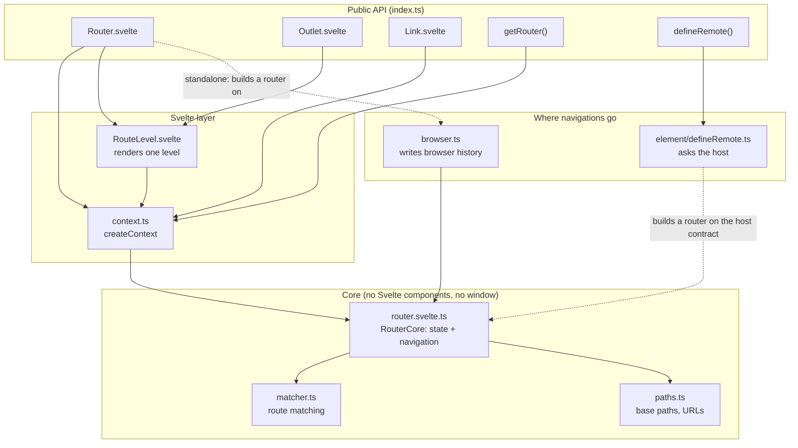
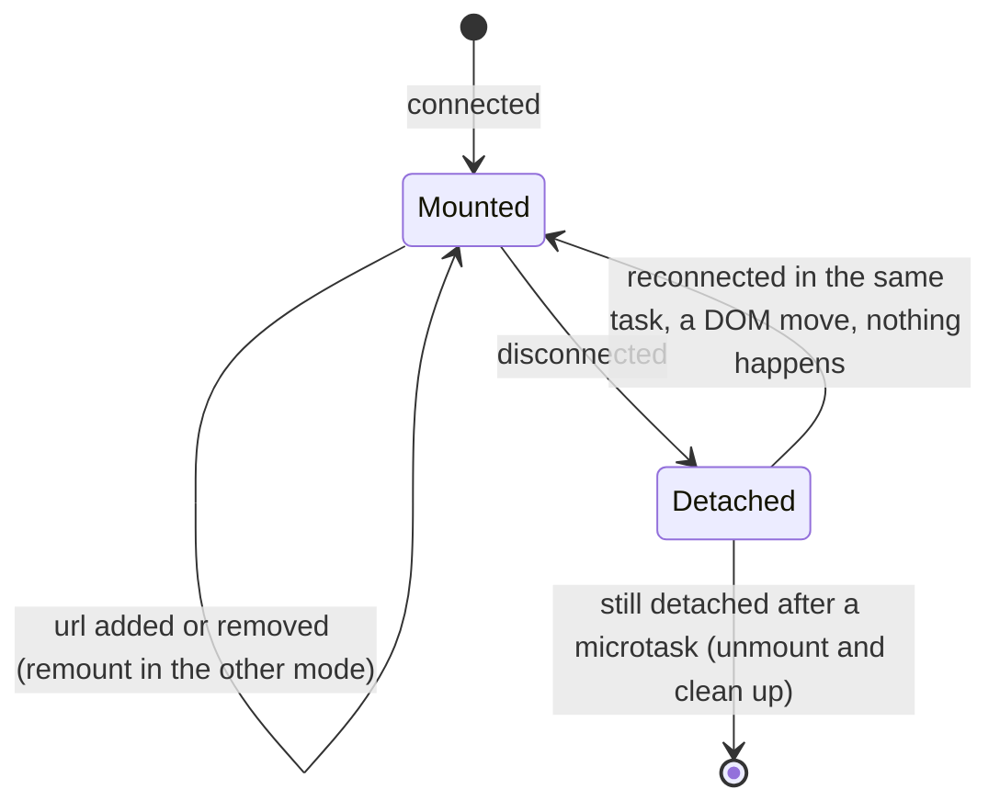
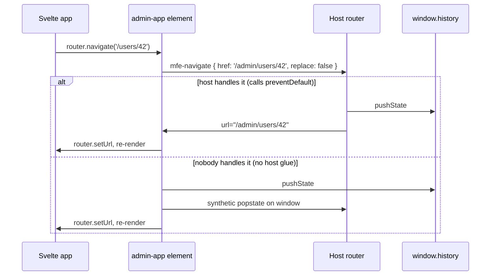

# Internals: how the library works

A tour of `packages/svelte-microfrontend-router/src`: what each piece does, how they connect, and why a few details are the way they are. For the problem and the design decisions, see [design.md](design.md). For usage, see the [README](../README.md).

The whole library is about 700 lines in 11 files.

## The layers



The idea that ties it together: **`RouterCore` holds the state and decides nothing about where a URL change goes.** It's given a `navigate` function when it's created. In a plain app that function writes browser history (`browser.ts`); inside a host it asks the host (`defineRemote.ts`). Everything above the core (components, links) is the same in both cases.

| File | Lines | Role |
| --- | --- | --- |
| `core/paths.ts` | 75 | Pure functions for base paths and URLs |
| `core/matcher.ts` | 148 | Pure route matching and ranking |
| `core/router.svelte.ts` | 141 | `RouterCore`: reactive state, derived location, navigation |
| `core/browser.ts` | 39 | Browser history adapter |
| `context.ts` | 34 | Passes the router and outlet depth down through Svelte context |
| `components/Router.svelte` | 42 | Entry component: finds or creates the router, renders level 0 |
| `components/RouteLevel.svelte` | 17 | Renders the matched route at one depth |
| `components/Outlet.svelte` | 9 | Renders the next depth inside a layout |
| `components/Link.svelte` | 39 | `<a>` that navigates through the router |
| `element/defineRemote.ts` | 140 | The custom element: the host contract |
| `index.ts` | 9 | Public exports |

## Core

### `paths.ts`: base paths and URLs

Small pure functions, all unit-tested:

- `normalizeBase('admin/')` → `/admin`. Leading slash, no trailing slash, `/` for the root.
- `stripBase('/admin', '/admin/users/42')` → `/users/42`. Returns `null` when the path is outside the base, including look-alikes: `stripBase('/admin', '/administrator')` is `null`.
- `joinBase('/admin', '/users')` → `/admin/users`, and `joinBase('/admin', '/')` → `/admin`.
- `resolveTarget(to, currentPath)` resolves a link target like a browser would, using `new URL(to, 'http://router.invalid' + currentPath)`. That gives query-only (`?role=editor`) and hash-only (`#top`) targets for free, and **`..` can never climb above the base root**, because the dummy origin's root is the base.
- `isAbsoluteUrl(to)`: `https:`, `mailto:`, `//host`. The router refuses these (see `href()` below).
- `sameUrl(a, b)` compares ignoring a trailing slash and percent-encoding (`/admin/` = `/admin`, `/a b` = `/a%20b`).

### `matcher.ts`: which route matches

Routes are a table: `{ path, component, children? }`. A path like `/users/:id` is parsed once (and cached in a `WeakMap`) into segments: **static** (`users`), **param** (`:id`) or **wildcard** (`*`, only allowed last).

Matching walks the table recursively:

1. For each route, match its segments against the **start** of the remaining path.
2. If the route has `children`, match them against what's left. The chain is `[parent, child, ...]`, and params accumulate down the chain.
3. A route without children only matches if nothing is left (or it ends in `*`, which takes the rest).
4. Every candidate chain gets a **rank array**, one number per segment: static 3, param 2, wildcard 1, plus a final 4 when the chain ended exactly where the path ended.
5. Rank arrays are compared left to right, and the highest wins. On a tie, the route declared first wins.

Example for `/users/new` with routes `/users/:id` and `/users/new`:

| Candidate | Ranks | |
| --- | --- | --- |
| `/users/:id` | `[3, 2, 4]` | |
| `/users/new` | `[3, 3, 4]` | wins at the second segment |

The "exact end" rank is why `/` beats `*` at the root: `[4]` vs `[1]`. Without it, the catch-all would win (that was an early bug).

Params are `decodeURIComponent`-decoded, so `/users/jane%20doe` gives `{ id: 'jane doe' }`. The matcher returns `[]` when nothing matches.

### `router.svelte.ts`: `RouterCore`

A plain class in a `.svelte.ts` module, so it can use runes without being a component:

```
#url, #basePath, #routes          $state (the inputs)
        │
        ▼
#parts   = parseUrl(#url)                            $derived
#path    = stripBase(#basePath, #parts.pathname)     $derived  (null = outside the base)
#matches = #path === null ? [] : matchRoutes(...)    $derived
#query   = new URLSearchParams(#parts.search)        $derived
```

Only three things change the state: `setUrl()`, `setBasePath()` and `setRoutes()`. Everything a component reads (`path`, `params`, `query`, `hash`, `matches`) is derived, so it can't drift from the URL.

**Navigation never updates the state directly.** `navigate(to)` turns `to` into a full href (`href()` adds the base path) and hands it to the injected `navigate` handler. Then it waits: the new location comes back through `setUrl()`, either from browser history or from the host setting the `url` attribute. The view therefore always shows the real URL, never a guess.

```
router.navigate('/users/42')
   │ href('/users/42') → '/admin/users/42'
   ▼
navigate handler (injected) ──▶ browser history, or the host's router
                                        │
router.setUrl('/admin/users/42') ◀──────┘   (location comes back)
   │
   ▼ derived state updates → components re-render
```

Other details:
- `navigate` replaces instead of pushing when the target is the current URL (`sameUrl`), unless `replace` is given explicitly. Otherwise clicking the page you're on would add a duplicate entry, and Back would appear to do nothing.
- `href()` throws on absolute URLs rather than silently turning `https://x/y` into `/admin/y`.
- `navigateHost(href)` passes the href through unchanged, for leaving the app.
- `setQuery({ role: 'editor', page: null })` edits the current query (`null` removes a key), keeps the path and hash, and does nothing while the URL is outside the base.

### `browser.ts`: the browser adapter

Used when the router owns history (a plain app, or a remote running on its own):
- `writeHistory(href, replace)`: `pushState` (and scroll to top, like a page load) or `replaceState`.
- `listenToBrowser(router)`: a `popstate` listener that calls `router.setUrl(location)`, returning a function that removes it.
- `createBrowserRouter()`: a `RouterCore` whose `navigate` handler writes history and then feeds the new location back.

## Svelte layer

### `context.ts`: passing the router down

Uses Svelte's `createContext` (type-safe context, with a `has` function since Svelte 5.57) for two values:
- **the router**, read by `getRouter()`, `<Link>` and `<RouteLevel>`;
- **the outlet depth**, so each `<Outlet />` knows which level of the matched chain to render.

`getRouter()` throws a clear error when called outside a `<Router>` or a `defineRemote` app. In a plain app, `<Link>` must therefore be inside `<Router>`, which is why shared navigation goes in a root layout route.

### `Router.svelte`: the entry component

1. Looks for a router in context. Inside a `defineRemote` app there is one (the element put it there), so it uses that and ignores its `basePath` prop, because the host provides the base path.
2. Otherwise (a plain app), it creates a browser router, puts it in context, keeps its base path in sync with the `basePath` prop, and attaches the `popstate` listener in an `$effect` so it's removed on unmount.
3. Syncs the `routes` prop into the router with `$effect.pre`. Pre-effects run once as soon as they're created, so the routes are set before the first render.
4. Renders `<RouteLevel depth={0} />`.

### `RouteLevel.svelte` and `Outlet.svelte`: nested routes

`RouteLevel` renders `router.matches[depth]` (the route component, with a `params` prop) and puts `depth + 1` in context. A layout component that renders `<Outlet />` reads that depth and renders another `RouteLevel` one level down.

```
matches = [Layout, UsersLayout, UserDetail]   for /users/42

<Router>
  RouteLevel depth 0 → <Layout>          ... <Outlet/>
    RouteLevel depth 1 → <UsersLayout>   ... <Outlet/>
      RouteLevel depth 2 → <UserDetail params={{ id: '42' }} />
```

When the URL changes from `/users/42` to `/users/7`, the same components stay mounted and only `params` changes. A component is replaced only when a different route matches at its level.

### `Link.svelte`

- Renders a real `<a>` with the full href (base included), so middle-click, "copy link" and "open in new tab" work.
- Intercepts a click only when it's a plain left click: no modifier keys, no `target` other than `_self`, no `download`, and not already cancelled by the app's own `onclick`. Then it calls `router.navigate(to, { replace })`.
- Absolute URLs (`https:`, `mailto:`, `//host`) are rendered as-is and left to the browser. `javascript:` URLs get no `href`.
- Sets `aria-current="page"` when its path equals the current path exactly (query ignored).

## The host contract: `defineRemote.ts`

`defineRemote(tag, App, { shadow })` defines a custom element class. It's written against public Svelte APIs only (`mount`, `unmount`, `createContext`), not Svelte's `customElement` compiler option, to keep full control of attributes, events and cleanup.

### Lifecycle



- **Mount** (`connectedCallback`): decides the mode from whether `url` is present, creates a `RouterCore` with the matching `navigate` handler, attaches a shadow root (unless `shadow: false`), and mounts the app.
- **Context:** `mount()` can't take `createContext` keys, so the element mounts a small wrapper function that sets the router in context and then calls `App`, the pattern from Svelte's context docs.
- **Attributes** (`attributeChangedCallback`): `url` → `router.setUrl()`, `base-path` → `router.setBasePath()`. The app re-renders without remounting. If `url` is added or removed, the mode changes, so the element unmounts and mounts again.
- **Unmount** (`disconnectedCallback`): deferred by one microtask. React and Vue move elements by disconnecting and reconnecting them in the same task, and that shouldn't wipe the app's state. Only if the element is still detached afterwards does it unmount the app and remove its listeners.
- **Liveness guard:** the `navigate` handler checks that the element is still connected and still owns that router. A late timer or fetch in an app that was already removed can't change the URL.

### The two modes

| | Host-managed (`url` set) | Self-managed (no `url`) |
| --- | --- | --- |
| Where the location comes from | the `url` attribute | `window.location` + a `popstate` listener |
| What `navigate` does | dispatches `mfe-navigate`, and falls back if nobody handles it | `pushState` / `replaceState`, then `setUrl` |
| Listeners on `window` | none | one `popstate` listener, removed on unmount |

### `mfe-navigate` and the fallback



The event is `bubbles: true` (hosts can listen higher up), `composed: true` (it would cross shadow boundaries if the element sat inside another shadow root) and `cancelable: true` (`preventDefault()` is how a host says "I've got it").

**The fallback is the only place the library dispatches a synthetic `popstate`.** It exists so a host with no glue still works: most routers (React Router, Vue Router, TanStack Router's browser history, plain listeners) re-read `window.location` on `popstate` and catch up. Its limits, which is why real hosts should handle the event:
- `popstate` listeners treat it like Back or Forward (analytics or scroll-restoration code may react to it);
- the new history entry carries no host router state (for example React Router's index);
- routers that don't re-read the URL on `popstate` won't follow.

In the demo, both hosts handle the event, so the fallback never runs there.

### Styles and Shadow DOM

With `shadow: true` (the default), the app renders inside a shadow root: host CSS doesn't reach it, and its CSS doesn't leak out. The remote compiles Svelte styles as injected (`css: 'injected'`), and Svelte appends each component's `<style>` to the root node of the mount target, which is the shadow root. Svelte keeps those style tags after unmount and reuses them (deduplicated by id) on the next mount.

## Three traces

**1. A click inside the remote, in the React host.**
`<Link to="/users/42">` click → `router.navigate` → href `/admin/users/42` → element dispatches `mfe-navigate` → React's `onmfe-navigate` prop calls `preventDefault()` and `navigate(href)` → React Router pushes the URL and re-renders `AdminRoute` → the `url` attribute becomes `/admin/users/42` → `attributeChangedCallback` → `router.setUrl` → `matches` updates → `UserDetail` renders. React Router's active link and location changed because React Router made the change.

**2. The back button, in the Vue host.**
Browser fires `popstate` → only Vue Router listens (the element has no `window` listener in host-managed mode) → Vue Router updates `route.fullPath` → `:url` binding updates the attribute → `router.setUrl` → the remote shows the previous page.

**3. The remote on its own.**
No `url` attribute, so self-managed: the element reads `window.location`, listens to `popstate`, and a link click does `pushState` then `setUrl`. A plain Svelte app using `<Router>` behaves the same way, through `browser.ts`.

## Details that look odd but are deliberate

- **No optimistic updates.** Waiting for the location to come back costs nothing (the host updates synchronously in practice) and guarantees the view matches the URL.
- **Attributes, not properties.** The element has no `url` or `basePath` JavaScript properties, so React 19 and Vue always set them as attributes, and string attributes work in any framework's templates.
- **A microtask before unmount.** It's what makes DOM moves safe. Everything that runs after removal (late navigations) is covered by the liveness guard.
- **`href()` throws on absolute URLs.** Silently rewriting `https://x/y` into `/admin/y` was a real bug found in review.
- **Known limits:** paths are case-sensitive, route patterns are matched literally (no encoded characters in patterns), `aria-current` is an exact match, defining the same tag twice returns the existing element without a warning, and there's no SSR.
